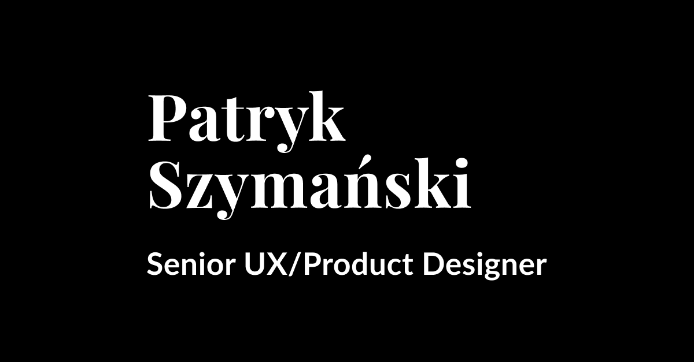

# Patryk Szymański Portfolio

This is the personal portfolio website for Patryk Szymański, a UX/Product Designer based in Kraków, Poland.

## Live website

[www.patrykszymanski.me](http://www.patrykszymanski.me)

## Technologies used

- [Eleventy](https://www.11ty.dev/) - Static site generator
- HTML/CSS/JavaScript
- Nunjucks templates (.njk)
- SCSS for styling

## Created with AI

2025:
- Dark mode
- Eleventy configuration and optimization
- Interactive shapes with simple physics game

## Commands

- `npm run dev` - Start development server with auto-reload
- `npm run build` - Build site for production
- `npm run serve` - Serve pre-built site
- `npm run preview` - Build and serve site

## License

© 2025 Patryk Szymański. All rights reserved.

Unauthorized reproduction or distribution of this portfolio or its contents is prohibited.